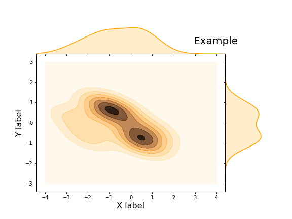

# Kde-Jointplot-Matplotlib



The seaborn library offers many tools for beautiful data visualization with great limitations in the number of customizable parameters. For example, in `sns.jointplot` there is no way to set a different size for different axes (not a square plot).

This is jointplot (kind = 'kde') implementation with matplotlib.

#### Example:
```python 
import pandas as pd
import numpy as np
from jointplot import jointplot_kde

# Generate data
data = pd.DataFrame(columns=["X", "Y"], data=np.random.randn(10, 2))

# Joint plot
jointplot_kde("X", "Y", data, xlim=(-4, 4), ylim=(-3, 3), figsize=(8, 6), 
              title="Example", xlabel="X label", ylabel="Y label", save="image/example.png")
````